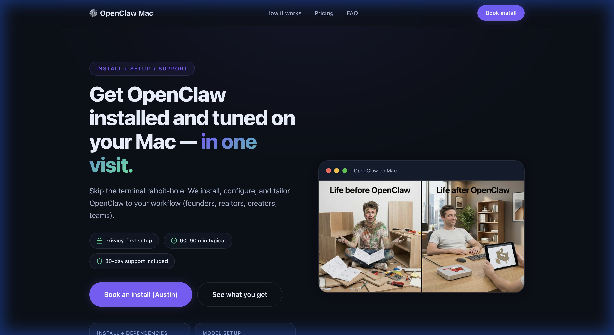
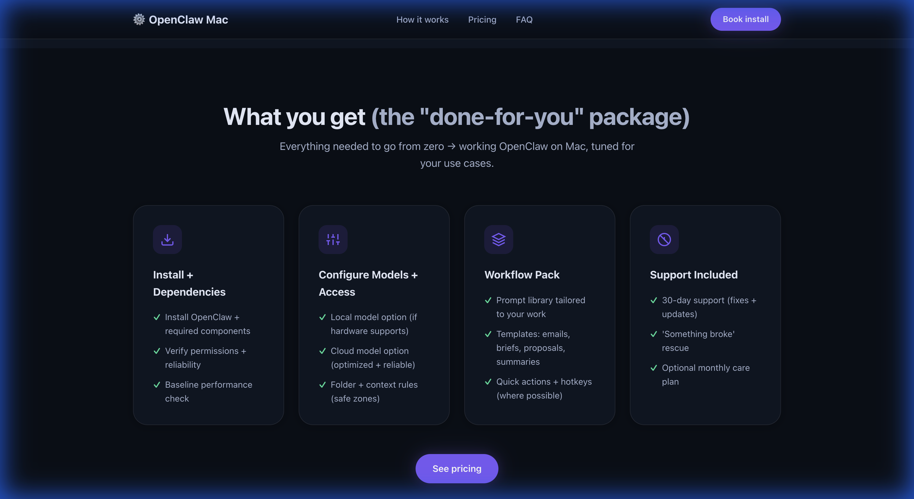
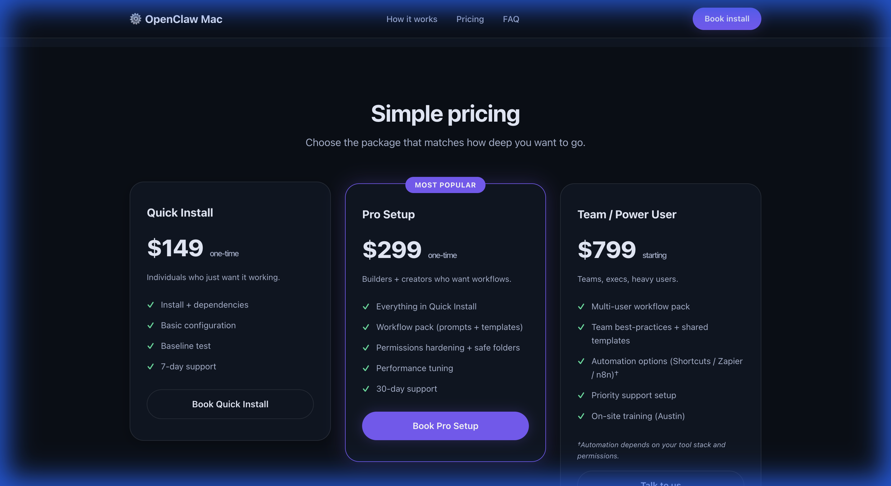
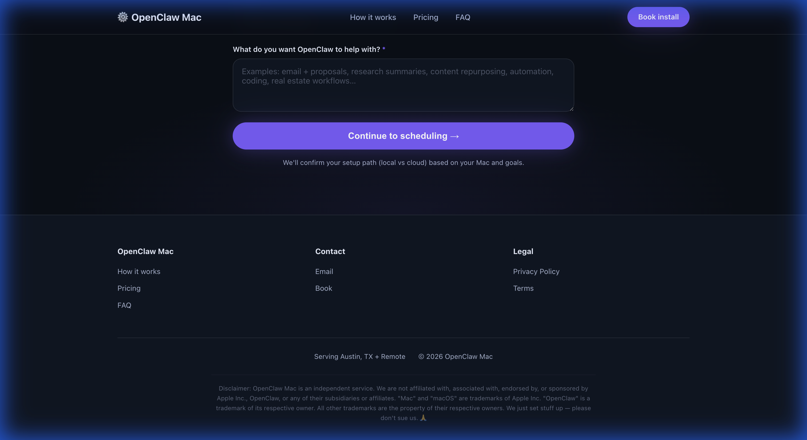

# ⚙️ OpenClaw Mac — Install + Setup + Support

> **Get OpenClaw installed and tuned on your Mac — in one visit.**

A high-conversion, single-scroll landing page for OpenClaw Mac setup services. Dark theme, 3D spatial design, zero frameworks.



---

## ✨ Features

- **3D Spatial Design** — CSS perspective containers, `rotateX`/`rotateY` hover lifts, volumetric shadows
- **Glow-Centric CTAs** — Breathing animations, layered halos, edge highlights on all primary buttons
- **Dark Mode First** — Comfortable contrast, reduced glare, 180ms transitions
- **Fully Responsive** — Mobile-first hamburger nav, fluid typography, touch-friendly
- **Zero Dependencies** — Pure HTML + CSS + JS. No frameworks, no build step
- **Scroll Animations** — Intersection Observer-powered fade-ins for every section
- **FAQ Accordion** — Expandable Q&A with smooth height transitions
- **Booking Form** — Input validation with Calendly redirect



---

## 💰 Pricing

Three tiers — Quick Install ($149), Pro Setup ($299), and Team / Power User ($799+).



---

## 🛠 Tech Stack

| Layer | Choice |
|-------|--------|
| Structure | Semantic HTML5 |
| Styling | Vanilla CSS (custom properties, 3D transforms) |
| Logic | Vanilla JavaScript (Intersection Observer, DOM) |
| Fonts | System font stack (`system-ui`, `-apple-system`) |
| Build | None — static files, no tooling required |

---

## 🚀 Quick Start

```bash
# Clone the repo
git clone https://github.com/Wikiup/openclawmac.com.git
cd openclawmac.com

# Serve locally (pick one)
npx -y http-server . -p 8080 -c-1
# or
python3 -m http.server 8080

# Open http://localhost:8080
```

---

## 📁 Project Structure

```
openclawmac.com/
├── index.html          # Single-page markup (10 sections)
├── index.css           # Design system + 3D spatial styles
├── index.js            # Scroll animations, nav, FAQ, form
├── images/             # Hero + testimonial assets
├── screenshots/        # README screenshots
└── README.md
```

---

## 📸 More Screenshots

<details>
<summary>Footer with legal disclaimer</summary>



</details>

---

## 🔧 Customization

| What | Where |
|------|-------|
| Colors & tokens | `:root` block in `index.css` (lines 1–30) |
| Pricing amounts | `#pricing` section in `index.html` |
| Calendly URL | `CALENDLY_URL` constant in `index.js` |
| FAQ content | `#faq` section in `index.html` |
| Images | `images/` directory |

---

## 📦 Deployment

Static site — deploy anywhere:

- **Cloudflare Pages** — `npx wrangler pages deploy .`
- **Netlify** — Drag-and-drop or connect repo
- **Vercel** — `npx vercel --prod`
- **GitHub Pages** — Push to `main`, enable in repo settings

---

## ⚖️ Disclaimer

OpenClaw Mac is an independent service. We are not affiliated with, associated with, endorsed by, or sponsored by Apple Inc., OpenClaw, or any of their subsidiaries or affiliates. "Mac" and "macOS" are trademarks of Apple Inc. "OpenClaw" is a trademark of its respective owner.

---

## 📄 License

© 2026 OpenClaw Mac. All rights reserved.
